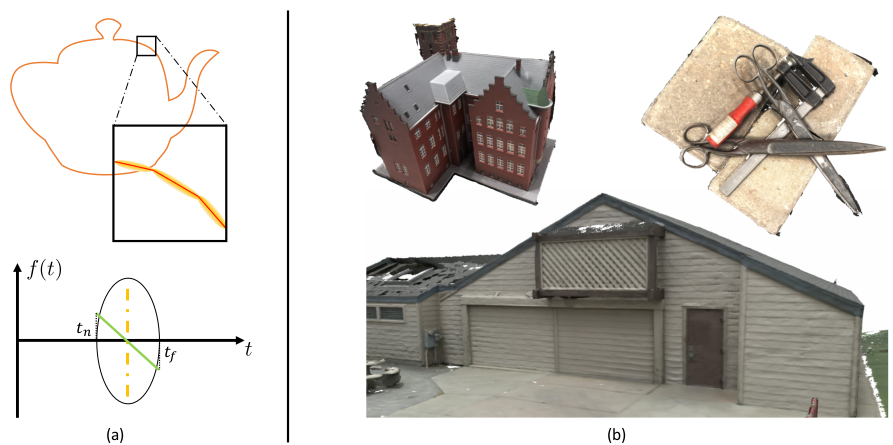

# SDLKF: Signed Distance Linear Kernel Function for Surface Reconstruction

[Paper](assets/paper.pdf) |<br>



This repo contains the official implementation for the paper "SDLKF: Signed Distance Linear Kernel Function for Surface Reconstruction. Our work represents a scene with a set of Linear SDF Kernel Function which has an analytic solution for volume rendering instead of numeric approximation.


## Installation

```bash
# download
git clone https://github.com/otakuxiang/GUDF.git --recursive

# if you have an environment used for 3dgs, use it
```
## Training
To train a scene, simply use
```bash
python train.py -s <path to COLMAP or NeRF Synthetic dataset>
```
Commandline arguments for regularizations
```bash
--multi_view_ncc_weight  # hyperparameter for multiview ncc loss
--lambda_normal # hyperparameter for normal reg
```

## Testing
### Bounded Mesh Extraction
To export a mesh within a bounded volume, simply use
```bash
python render_pgsr.py -m <path to pre-trained model> -s <path to COLMAP dataset> 
```
Commandline arguments you should adjust accordingly for meshing for bounded TSDF fusion, use
```bash
--voxel_size # voxel size
```

### Quick Examples

If you have downloaded the DTU dataset, you can use
```bash
python train.py -s <path_to_scene> -m output/dtu/<scanid> -r 2 --depth_ratio 0. --multi_view_weight_from_iter 7000 --preload_img --multi_view_ncc_weight 0.5
python render_pgsr.py --iteration 20000 -m output/dtu/<scanid> --depth_ratio 0 
```
We have provide the script for running DTU dataset, please see [script](scripts/train_dtu.sh)

## Acknowledgements
This project is built upon [2DGS](https://github.com/hbb1/2d-gaussian-splatting). The TSDF fusion for extracting mesh is based on [Open3D](https://github.com/isl-org/Open3D). The rendering script for MipNeRF360 is adopted from [Multinerf](https://github.com/google-research/multinerf/), while the evaluation scripts for DTU and Tanks and Temples dataset are taken from [DTUeval-python](https://github.com/jzhangbs/DTUeval-python) and [TanksAndTemples](https://github.com/isl-org/TanksAndTemples/tree/master/python_toolbox/evaluation), respectively. We thank all the authors for their great repos. 
